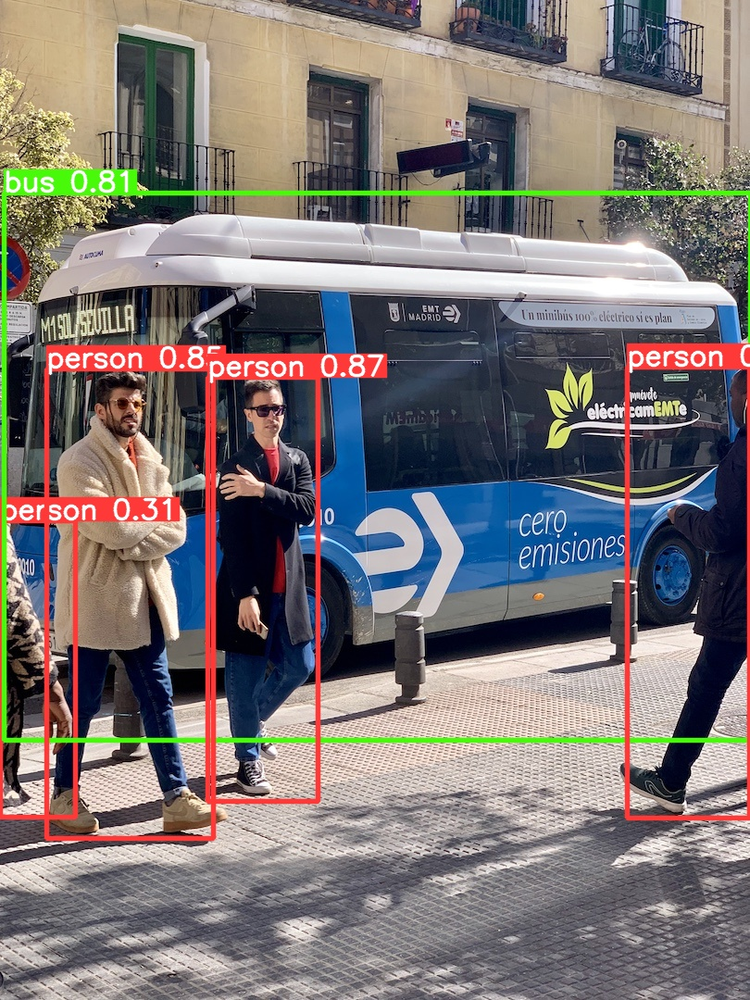

# Human_Detection_Alert


<!-- TABLE OF CONTENTS -->
<details>
  <summary>Table of Contents</summary>
  <ol>
    <li>
      <a href="#about-the-project">About The Project</a>
      <ul>
        <li><a href="#built-with">Built With</a></li>
      </ul>
    </li>
    <li>
      <a href="#getting-started">Getting Started</a>
      <ul>
        <li><a href="#prerequisites">Prerequisites</a></li>
        <li><a href="#installation">Installation</a></li>
      </ul>
    </li>
    <li><a href="#usage">Usage</a></li>
    <li><a href="#license">License</a></li>
    <li><a href="#contact">Contact</a></li>
    <li><a href="#acknowledgments">Acknowledgments</a></li>
  </ol>
</details>


<!-- ABOUT THE PROJECT -->
## About The Project

we built a human detection project with the use of yolov5 by using our custom dataset

### Built With

* yolov5
* roboflow


<!-- GETTING STARTED -->
## Getting Started

we used VScode to run our yolov5 model to run it with cpu

### Prerequisites

* python
* roboflow

### Installation

1. Clone the repo
   ```sh
   git clone https://github.com/ultralytics/yolov5.git
   ```
2. Install required dependensies
   ```sh
   pip install -r requirements.txt
   ```
4. Enter your roboflow API of your custom dataset
   ```js
   const API_KEY = 'ENTER YOUR API';
   ```
5. Create a telegram Bot and Get its token & chatId
    ```sh
   installation guide video - https://youtu.be/NYT1KFE1X2o
   ```

<p align="right">(<a href="#top">back to top</a>)</p>


<!-- USAGE EXAMPLES -->
## Usage

* we can use this project to detect the human presence around our concerned area and share its data over telegram





<!-- LICENSE -->
## License

Distributed under the MIT License. See `LICENSE` for more information.


<!-- CONTACT -->
## Contact

* Jap Hirpara - [linkedIn profile](https://www.linkedin.com/in/jap-hirpara-0b42aa1a1/), email_id - jappatel1704@gmail.com
* Hiren lalani - [linkedIn profile](https://www.linkedin.com/in/hiren-lalani-8a6ba41b9/), email_id - hiren14lalani@gmail.com

Project Link: [Human_Detection_Alert](https://github.com/jap-patel/Human_Detection_Alert)


<!-- ACKNOWLEDGEMENTS -->
## Acknowledgements
* [Ultralytics/yolov5](https://github.com/ultralytics/yolov5)
* [Roboflow](https://roboflow.com/)
* [Vikas Jha](https://youtu.be/NYT1KFE1X2o)
